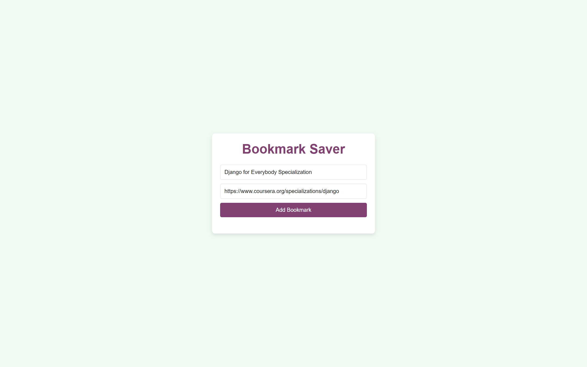
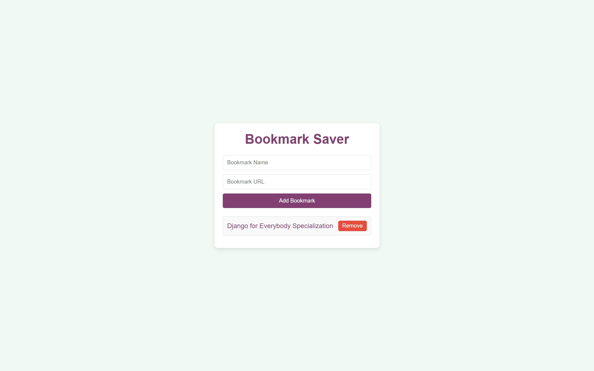
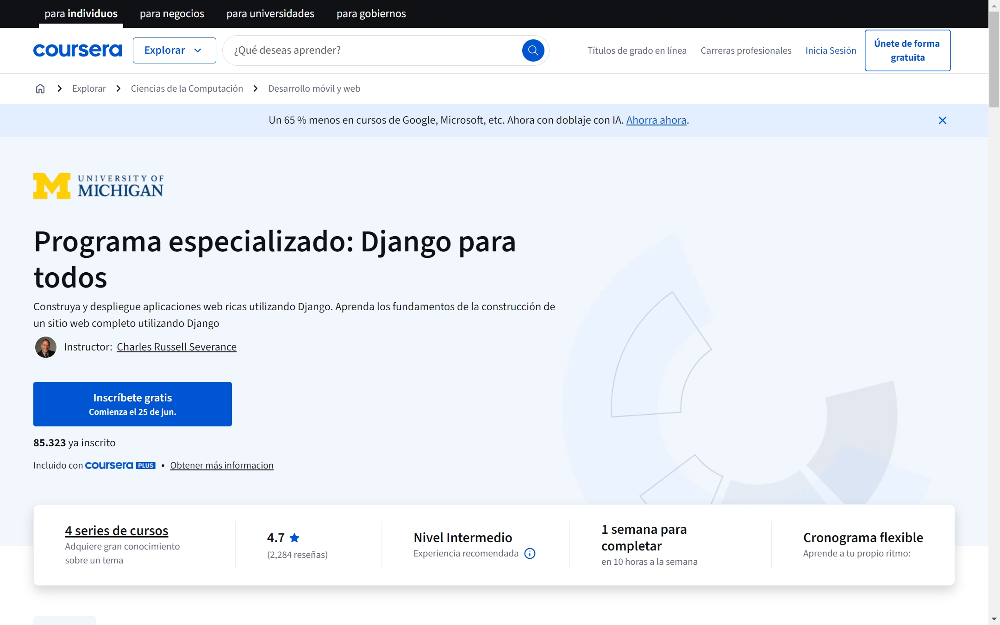

# Bookmark Saver

A simple web application to save, display, and manage bookmarks directly in your browser with data persistence.

## Main Files

- **index.html**  
  Main HTML structure with input fields and bookmark list.

- **styles.css**  
  Styles for layout, colors, buttons, and responsive design.

- **script.js**  
  JavaScript logic for adding, validating, saving, loading, and removing bookmarks using localStorage.

## Preview

  
*Main interface with input fields*

  
*Adding a new bookmark*

  
*Open new tab*

## Features

- Add bookmarks with validation (name required, URL must start with http:// or https://).  
- Display bookmarks as clickable links opening in new tabs.  
- Remove bookmarks from the list and localStorage.  
- Data persists across browser sessions via localStorage.  
- Clean, user-friendly interface.

## How to Use

1. Enter the bookmark name and URL in the input fields.  
2. Click the "Add Bookmark" button.  
3. See your bookmark appear below.  
4. Click "Remove" to delete a bookmark.  
5. Bookmarks will be saved locally and persist on reload.

## Technologies

- HTML5  
- CSS3  
- JavaScript (ES6)  
- Browser localStorage API

## Link
https://bookmarksaverjz.netlify.app/
